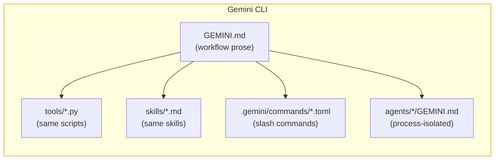

*This is the first post in a three-part series where we build the same AI-powered code review system two different ways — as a Python SDK pipeline and as a CLI agent — and compare every layer. We chose code review because it's simple enough to understand quickly but complex enough to make multi-agent thinking genuinely useful. Part 2 covers the CLI approach. Part 3 is the head-to-head.*

---

## Why code review? Why multi-agent?

Code review is a stacking problem. A single pull request demands four different mental models simultaneously: *is this safe?* (security), *is this maintainable?* (complexity), *does it match our conventions?* (style), and *will the next engineer understand it?* (documentation). Human reviewers hold all four imperfectly, and deterministic tools like Bandit, Semgrep, radon, and pylint each cover a slice without a unifying narrative.

The synthesis step — taking isolated findings, ranking them, connecting them, and turning them into something actionable — is exactly where LLMs shine. But a single "review this file" prompt that asks one model to be security auditor, refactoring coach, style pedant, and docstring writer simultaneously produces mediocre results on all four dimensions. The context gets crowded, priorities blur, and the output reads like a committee wrote it.

The answer is a multi-agent system: a specialist per dimension, plus an orchestrator that dispatches them and synthesizes their output. We call this system **Sentinel**.

---

## Meet Sentinel

Sentinel has four specialist reviewers, each with a clear lane:

| Specialist | What it catches |
|---|---|
| Security | Hardcoded secrets, dangerous calls like `eval` and `pickle`, SQL injection |
| Complexity | Cyclomatic complexity, over-long functions, too many parameters, deep nesting |
| Style | PEP 8 naming violations, missing type hints |
| Documentation | Missing docstrings, undocumented public APIs |

An orchestrator dispatches all four, collects their assessments, and produces a unified report with a verdict: **BLOCK**, **WARN**, or **PASS**.

To give all four specialists real work, we feed them an intentionally flawed file — an `AuthService` class with hardcoded passwords, SQL built by string concatenation, `pickle.loads` on session data, `eval` over raw user input, an eight-parameter method with nesting depth 5, class and method names that violate PEP 8, and zero docstrings anywhere. If a framework can't catch all of that, it's not doing its job.

---

## The foundation that doesn't change

Before getting into frameworks, it's worth understanding what stays constant across every implementation.

The real work happens in four pure Python modules — `analyzers/security.py`, `analyzers/complexity.py`, `analyzers/style.py`, `analyzers/documentation.py` — that know nothing about LLMs. They walk the AST, match patterns, and return structured findings. Because they're deterministic, we can test them independently with a plain integration suite that passes identically across every implementation. That suite is a contract the orchestration layer doesn't get to break.

The tools that wrap these analyzers follow a simple convention: take a file path as input, print JSON to stdout, exit with `0` for clean, `1` for findings found, `2` for tool error. That exit convention matters — it means the same tools plug into CI/CD pipelines without going through an LLM at all.

This separation is the most important architectural decision in the project. When we compare five different frameworks, the findings are identical every time because the deterministic core underneath doesn't care which orchestration layer sits above it.

---

## Part 1a: Google ADK

### The SDK mental model

In an SDK-style framework like Google ADK, **your code is the architecture**. Agents are Python objects. The orchestrator graph is declared in code. The LLM is a component your code calls — not the process running your code.

This feels familiar to most engineers: you write classes, wire dependencies, run tests. The agent graph is as legible as a class diagram. You never lose track of which agent does what because you wrote the lines that say so.

### Wiring the agents

Each specialist is a one-file `Agent` declaration. Here's the security reviewer:

```python
security_agent = Agent(
    name="SecurityReviewAgent",
    model="gemini-2.5-flash",
    description="Specialist in identifying security vulnerabilities in Python code.",
    instruction="""You are a security specialist. Use your tools to scan the
    provided file, then report findings with severity, line numbers, and
    concrete fix recommendations.""",
    tools=[scan_for_secrets, scan_for_dangerous_calls, scan_for_injection],
)
```

The tools are ordinary Python functions with type annotations. ADK introspects those annotations to generate the JSON schema the model sees — you never write a tool manifest by hand.

The orchestrator wires all four together:

```python
root_agent = Agent(
    name="SentinelOrchestrator",
    model="gemini-2.5-flash",
    instruction="""Dispatch all four specialist reviewers against the target file,
    collect their findings, and synthesize a unified report.""",
    sub_agents=[security_agent, complexity_agent, style_agent, doc_agent],
)
```

### Running a review

Starting a review is a few lines of async Python:

```python
async def run_review(filepath: str):
    session_service = InMemorySessionService()
    runner = Runner(agent=root_agent, session_service=session_service)

    async for event in runner.run(user_message=f"Review {filepath}"):
        if event.is_final_response():
            print(event.response.text)
```

The `Runner` handles everything: sending the initial message to the orchestrator, letting the orchestrator dispatch sub-agents, managing the tool-calling loops inside each specialist, collecting results, and invoking the final synthesis call. When the graph loads, it reports cleanly — one orchestrator, four sub-agents, seven specialist tools. That wiring exists because the code says so.

ADK also dispatches the four specialists in parallel. Wall-clock time is bounded by the slowest reviewer, not the sum of all four.




### What ADK does well

The SDK paradigm earns its overhead in a few specific scenarios. If you're building a web-based product — a "review this PR" button inside your code hosting platform — you need an HTTP endpoint, predictable latency, and container deployment. Wrap the `Runner` in FastAPI and you have a production service. ADK also lets you *enforce* workflow at the framework level: "always run all four specialists" isn't a prose instruction a model might skip — it's a graph edge that cannot be bypassed.

For safety-critical pipelines, that enforcement matters. Compliance scanning and financial validation workflows can't rely on a model deciding to follow a prose description of the process. You want that guaranteed in code.

### What it's slow at

The flip side shows up the moment you want to change behavior. Tweaking the security reviewer's tone means editing a triple-quoted Python string, redeploying, and restarting the runner. Non-engineers — security leads, compliance officers, senior engineers who don't write Python — are locked out of contributing to agent logic. And when something goes wrong, "what did the orchestrator decide?" is buried in event stream logs, not visible in the terminal.

---

## Part 1b: Running Locally with Ollama

### Why local models matter

Cloud API implementations raise two uncomfortable questions for production teams: *who sees your code?* and *what does this cost at scale?*

Security-sensitive codebases — financial systems, healthcare platforms, proprietary algorithms — often can't send source code to external APIs under compliance frameworks like SOC 2, HIPAA, or internal data-handling policies. Even when policy allows it, API costs for reviewing hundreds of PRs per day add up fast. Running the LLM locally solves both.

| Factor | Cloud API | Local (Ollama) |
|---|---|---|
| Data leaves your machine | Yes | No |
| Cost per review | $0.01–0.10+ | ~$0 (compute only) |
| Air-gap compatible | No | Yes |
| Latency | ~2–5s round-trip | ~5–15s local inference |
| Setup | API key | `ollama pull qwen3.5:9b` |

### What we had to change

ADK's `Agent` class is wired to Gemini endpoints, so we couldn't use it with Ollama. Instead, we wrote a minimal `BaseAgent` class that implements the tool-calling loop directly against Ollama's API — the part ADK normally handles invisibly.

The loop itself isn't complicated: send a message, check whether the model wants to call a tool, execute the tool, append the result, repeat until the model produces a final answer. Writing it yourself makes the mechanics explicit in a way that's actually clarifying:

```python
def run(self, user_message: str) -> str:
    messages = [{"role": "system", "content": self.instruction},
                {"role": "user", "content": user_message}]
    while True:
        response = self._client.chat(model="qwen3.5:9b",
                                     messages=messages,
                                     tools=self.tool_schemas)
        msg = response.message
        if not msg.tool_calls:
            return msg.content  # model is done

        # execute each tool call and feed results back
        for call in msg.tool_calls:
            fn = self.tool_implementations[call.function.name]
            result = fn(**call.function.arguments)
            messages.append({"role": "tool", "content": json.dumps(result)})
```

One other thing shifts: ADK generates tool schemas from Python type annotations automatically. Ollama requires explicit JSON schema objects. The underlying analyzer logic doesn't change — you're just wrapping it in a slightly more verbose declaration.

The other practical difference is that ADK's parallel dispatch becomes sequential — the Ollama orchestrator runs each specialist in order, then makes a synthesis call. Not ideal for latency, but entirely workable for a developer tool where you're waiting seconds, not milliseconds.

### Running `qwen3.5:9b` against our cursed file

```
[1/4] Running SecurityReviewAgent...
[2/4] Running ComplexityReviewAgent...
[3/4] Running StyleReviewAgent...
[4/4] Running DocumentationReviewAgent...
[5/5] Synthesizing final report...

Verdict: BLOCK
```

| Dimension | Status | Key Findings |
|---|---|---|
| Security | CRITICAL | 2 hardcoded secrets, 2 SQL injections, `eval()`, `pickle.loads()` |
| Complexity | WARNING | `get_user_data`: 8 parameters, nesting depth 5, cyclomatic complexity 8 |
| Style | WARNING | 2 naming violations, 12 missing type hints |
| Documentation | CRITICAL | 0% docstring coverage across all 7 public APIs |

The findings match the cloud API run exactly. The deterministic analyzer layer underneath doesn't care which LLM is above it.

---

## What we learned from Part 1

Building Sentinel with the Python SDK gives you something that feels like software: typed contracts, testable objects, a graph structure that enforces workflow. You know what the system will do before you run it because you wrote the code that says so.

The Ollama variant adds something important to the picture: the SDK pattern isn't locked to cloud APIs. With a 50-line tool-calling loop pointed at `localhost:11434`, you get the same multi-agent architecture with no code leaving your machine.

The limitation is also clear. Every change to agent behavior — every tweak to how severity is reported, every adjustment to the tone of a code fix recommendation — flows through a Python PR and a redeploy. For a stable, high-throughput production pipeline, that's fine. For a system whose behavior needs to evolve quickly, or where non-engineers need to contribute, it becomes friction.

That's exactly the problem Part 2 solves — by inverting the whole model.

---

*In [Part 2](https://ahfs.github.io/research-notes/), we rebuild Sentinel as a CLI agent using Claude Code, Gemini CLI, and opencode, and explore what it means when the LLM is the top-level reasoning process instead of a component your code calls.*
