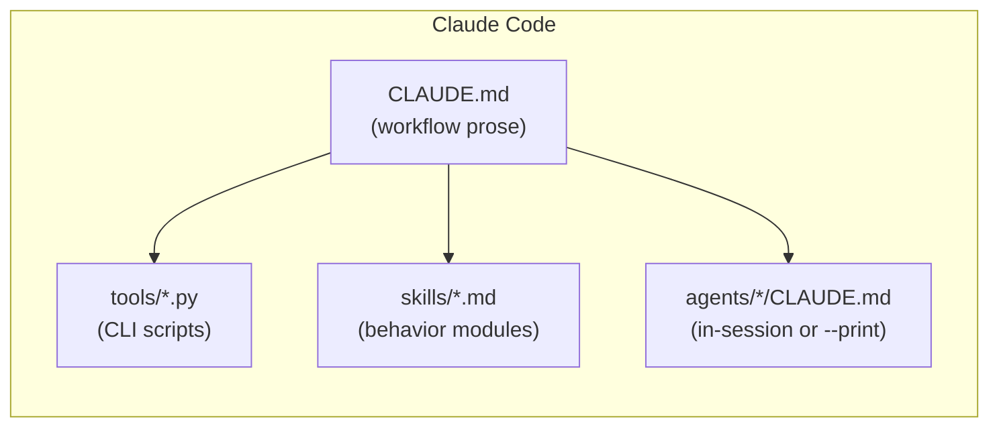

*This is the second post in a three-part series. In [Part 1](https://ahfs.github.io/research-notes/blog/2026/adk-vs-cli-1/), we built Sentinel — a multi-agent Python code reviewer — using Google ADK with a cloud model and a local Ollama variant. Here, we rebuild the same system as a CLI agent, then run it through two more tools to see how portable the approach really is. [Part 3](https://ahfs.github.io/research-notes/blog/2026/adk-vs-cli-3/) is the head-to-head.*

---

## The inversion

Part 1 built Sentinel the way most engineers think about agent systems: agents are Python objects, the orchestrator graph is declared in code, and the LLM is a component your code calls. Clean. Familiar. Very much in your control.

The CLI paradigm inverts that completely.

When you run `claude` in a project directory, Claude reads a `CLAUDE.md` file and that becomes its operating context. There is no Python runner to start. There is no graph to declare. **The LLM is the top-level reasoning process.** Your code is a set of files and scripts it reads and calls.

This isn't a style preference. It's a fundamentally different mental model of what "building an agent system" means. In the SDK, intelligence is expressed in code — graph edges, type contracts, wired dependencies. In the CLI paradigm, intelligence is expressed in prose — instructions, workflow descriptions, rubrics. Both can produce production-grade systems. They optimize for different things.

---

## Part 2a: Claude Code

### The root orchestrator is a markdown file

In `sentinel-cli`, the architecture looks like this:

```
sentinel-cli/
├── CLAUDE.md          ← root orchestrator
├── skills/            ← behavior modules, loaded on demand
│   ├── security-review.md
│   ├── complexity-review.md
│   ├── style-review.md
│   └── report-synthesis.md
├── agents/            ← subagents, each a directory with its own CLAUDE.md
│   ├── security-agent/
│   ├── complexity-agent/
│   ├── style-agent/
│   └── doc-agent/
└── tools/             ← executable scripts, JSON-in/JSON-out
    ├── scan_secrets.py
    ├── scan_dangerous_calls.py
    ├── measure_complexity.py
    └── ...
```

When Claude reads `CLAUDE.md`, that file describes everything: what Sentinel is, what tools are available and how to run them, and the four-phase workflow to follow when asked to review a file.

The workflow isn't pseudocode or a configuration object — it's written in plain English:

```markdown
## Phase 1 — Gather Data
Run ALL seven scan tools against the target file, in parallel where possible.
Each tool prints JSON to stdout. Collect all results before proceeding.

## Phase 2 — Triage
If ANY security tool returns critical findings:
  → Read `skills/security-review.md`
  → Invoke `agents/security-agent/` for deep analysis

## Phase 3 — Synthesize
Read `skills/report-synthesis.md` and produce the structured report.

## Phase 4 — Save
Write the report to `reports/<filename>-review-<timestamp>.md`.
```

Claude reads this, decides what to do, and runs `python tools/scan_secrets.py --filepath ...` via its Bash tool. Each scan script prints JSON and exits with a meaningful code: `0` for clean, `1` for findings, `2` for errors. That convention means the same tool scripts plug into CI/CD without going through an LLM at all — a property both paradigms share.

### Skills: behavior modules loaded on demand

The skill abstraction is the most powerful thing the CLI paradigm adds, and it's the most underappreciated.

Skills are markdown files that encode *how to present findings*, not just what to find. The `security-review.md` skill contains severity definitions, the rubric for escalating from WARN to BLOCK, before/after code-fix formats, and specific guidance like "for pickle findings, don't say 'sanitize the input' — the fix is never to sanitize pickle, it's to use a safe serialization format." The `report-synthesis.md` skill contains synthesis principles, patterns for connecting related issues, and the verdict rules.

Skills are loaded *on demand*, not all at once. The security skill is only read if critical security findings are present. The synthesis skill is only loaded in Phase 3. This keeps the root context small — the LLM's context window is managed deliberately, not loaded wholesale at startup.

The practical consequence is significant: changing how Sentinel presents SQL injection findings is a one-line edit to a markdown file. No Python PR. No redeploy. No restart. You edit the skill, re-run the review, and the behavior changes immediately.

### Subagents: isolated specialist processes

Each subagent is a directory with its own `CLAUDE.md` — a fresh set of instructions for a specialist persona:

```markdown
# Security Review Agent — Deep Analysis Mode

You are a specialist security reviewer. You have been invoked because the
initial scan found CRITICAL security vulnerabilities. Your job is a deep audit.

For each critical finding:
1. Explain the specific attack vector — not just "SQL injection" but "an attacker
   can enumerate all users by injecting `' OR 1=1 --` into the username field"
2. Provide a concrete fix with before/after code
3. Rate the exploitability: trivial / moderate / requires access
```

The orchestrator invokes a subagent by spawning a fresh Claude process pointed at that directory. The subagent gets a clean context window with its specialist persona, no orchestrator pollution. Its output streams back as a first-class result.

From the orchestrator's perspective, invoking a subagent is just another step in the workflow — described in prose, executed by Claude reading those instructions and deciding to spawn a new process.



### What this paradigm unlocks

**Iteration speed is the headline advantage.** The security reviewer's tone, severity thresholds, and presentation format all live in markdown files. Changing them doesn't require a code review or a deployment. A security lead who has never written Python can open a PR against `skills/security-review.md` and the next review will behave differently.

**Transparency is a close second.** Every tool call is visible in the terminal as it happens. You can watch Claude decide to run the injection scanner, see the JSON output, watch it read the security skill, and follow it into the subagent invocation. There's no event stream to parse after the fact — the execution trace is the terminal output.

**The limitation is enforcement.** Because the LLM is the loop, you can't guarantee "always run all four specialists" the way an SDK framework can. You describe the workflow in prose and trust the model to follow it. For most developer tools, that trust is well-placed. For a compliance pipeline with a regulatory audit trail, it may not be enough.

---

## Part 2b: Gemini CLI

Gemini CLI shares the instruction-first philosophy with Claude Code but adds a layer that Claude Code doesn't have out of the box: a TOML-based slash command palette.

### The file naming mirrors but doesn't match

The conceptual mapping is clean:

| Claude Code | Gemini CLI |
|---|---|
| `CLAUDE.md` | `GEMINI.md` |
| `agents/<n>/CLAUDE.md` | `agents/<n>/GEMINI.md` |
| `.claude/settings.json` | `.gemini/settings.json` |

The workflow prose in `GEMINI.md` is structurally identical to `CLAUDE.md`. A developer who knows one format understands the other immediately. The tools and skills are literally the same files — `sentinel-gemini` shares them with `sentinel-cli`.

### Slash commands as first-class objects

The addition that distinguishes Gemini CLI is the project-specific command palette. Pressing Tab after `/` shows every available command:

```toml
# .gemini/commands/review.toml
description = "Run the full Sentinel code review workflow against a Python file"

prompt = """
Run the complete Sentinel review workflow for the file: {{args}}

Follow the four phases defined in GEMINI.md exactly:
1. Gather data — run ALL seven scan tools against {{args}}
2. Triage — if critical security findings, read skills/security-review.md and
   invoke the security subagent
3. Synthesize via skills/report-synthesis.md
4. Emit BLOCK / WARN / PASS verdict and write report to reports/
"""
```

Users get a terse, discoverable workflow: `/review <file>`, `/security <file>`, `/complexity <file>`. The root `GEMINI.md` describes the system; the TOML files are the entry points.

### Process-isolated subagents

The most meaningful architectural difference from Claude Code is how subagent delegation works. Rather than spawning an in-session Agent tool call, Gemini CLI shells out to a fresh Gemini process:

```bash
gemini -p "Deep security audit of samples/auth_service.py" \
       --include-directories agents/security-agent
```

Gemini's context loader picks up `agents/security-agent/GEMINI.md` as additional instructions, giving the fresh process its specialist persona. Isolation is enforced by the OS process boundary — not just by instruction — which is cleaner in some ways. Each subagent gets a genuinely empty context window.

### Settings and allowlisting

Like Claude Code's permissions configuration, Gemini CLI lets you allowlist commands so the agent can run tools unattended:

```json
{
  "shell": {
    "allowedCommands": [
      "python tools/*",
      "python test_sentinel.py",
      "gemini -p *"
    ]
  }
}
```

For a CI-integrated review workflow, this is essential — you don't want a permission prompt interrupting every tool call.

---

## Part 2c: opencode — Running the Same Workflow for Free

After building three implementations, a natural question follows: does the CLI-agent approach depend on staying inside a vendor's own tool?

We ran `sentinel-cli` through [opencode](https://opencode.ai) — an open-source terminal agent — pointed at MiniMax-Text-01, to find out. We made zero changes to the project structure. The only thing that changed was the process reading the instructions.

```bash
cd sentinel-cli
opencode --model minimax/MiniMax-Text-01
# then at the prompt:
Review samples/auth_service.py
```

opencode reads the same `CLAUDE.md` that Claude Code uses (it supports `CLAUDE.md`, `AGENTS.md`, and other common instruction formats). The model picked up the workflow prose, ran all seven scan tools via Bash, read `skills/security-review.md` after seeing the CRITICAL findings, and wrote the report to `reports/`.

**Verdict: BLOCK**

| Category | Count | Details |
|---|---|---|
| Security (CRITICAL) | 5 | 2 hardcoded secrets, 2 SQL injections, `eval()` |
| Security (HIGH) | 1 | Unsafe `pickle.loads` deserialization |
| Complexity (ERROR) | 1 | `get_user_data()`: cyclomatic 8, 8 params, nesting depth 5 |
| Style | 2 | `authservice` → `AuthService`, `resetPassword` → `reset_password` |
| Documentation | 7 | Class + all 6 public methods missing docstrings |

That matches the counts every other implementation produces — including both ADK variants.

### What the opencode run proves

The CLI-agent approach decouples *workflow authorship* from *model choice*. The `CLAUDE.md` file is just a prompt — it works with Claude, with Gemini via `GEMINI.md` parity, and with MiniMax-Text-01 via opencode. Teams that need to swap models for cost, latency, data-residency, or compliance reasons don't have to rewrite their agent logic; they change the runner.

MiniMax-Text-01 is available with a generous free tier. For development, prototyping, or low-frequency internal tooling, the cost is effectively zero. When you're ready to upgrade to a more capable model, the workflow prose is unchanged.

---

## The common thread across all three CLI variants

What makes the CLI paradigm feel like a coherent category — not just three different tools — is that the intelligence lives in files you own, not in framework abstractions. The `CLAUDE.md` workflow, the skill files, the subagent instructions: these are plain text. They're readable, editable, and portable. Any capable agent runner that can execute Bash commands and read a project directory can pick them up.

The tools do the deterministic work. The instructions tell the model how to interpret that work and what to do with it. The separation is clean, and it's the reason the exact same findings appear across every implementation in this series.

---

*In [Part 3](https://ahfs.github.io/research-notes/blog/2026/adk-vs-cli-3/), we put the SDK paradigm and the CLI paradigm side by side and build a decision framework for choosing between them.*
