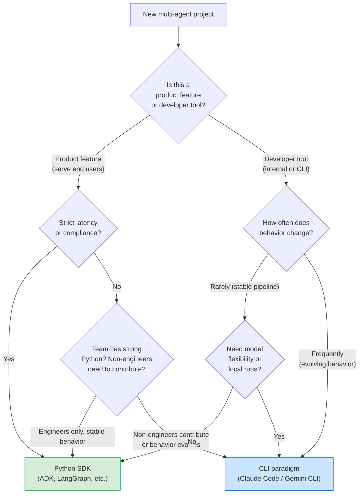

*This is the final post in a three-part series. [Part 1](https://ahfs.github.io/research-notes/blog/2026/adk-vs-cli-1/) covered building Sentinel — our multi-agent Python code reviewer — with Google ADK and a local Ollama variant. [Part 2](https://ahfs.github.io/research-notes/blog/2026/adk-vs-cli-2/) rebuilt it as a CLI agent using Claude Code, Gemini CLI, and opencode. Here we compare every dimension and build a framework for deciding which paradigm belongs in your next project.*

---

## Before the comparison: what stayed the same

Here's the architectural observation that's easy to miss when you focus on which paradigm "wins."

All five implementations share the **same deterministic core**. The findings on our cursed `AuthService` file are identical in every run — ADK with Gemini 2.5, ADK with Ollama, Claude Code, Gemini CLI, opencode with MiniMax-Text-01:

| Category | Findings | Consistent across all 5? |
|---|---|---|
| Hardcoded secrets | 2 (lines 5–6) | Yes |
| SQL injections | 2 (lines 14, 37) | Yes |
| Dangerous calls | `eval` + `pickle.loads` | Yes |
| Complexity errors | 1 (`get_user_data`) | Yes |
| Naming violations | 2 | Yes |
| Missing type hints | 12 | Yes |
| Missing docstrings | 7 | Yes |

The LLM above the analyzer layer is entirely interchangeable. The deterministic tool layer does the actual work — the LLM's job is to invoke the tools correctly and present the results well.

This separation matters more than the paradigm choice. Keep the deterministic layer deterministic. Don't let your orchestration framework bleed into it. If an analyzer needs to change, that's a Python PR with tests. If the reviewer's *presentation* needs to change, that's a markdown edit. If you want to swap frameworks entirely, you keep the analyzers and change the wiring.

With that in mind, let's compare what actually differs.

---

## The core distinction

```
SDK paradigm:   Your code calls the LLM
CLI paradigm:   The LLM calls your code
```

That's not just a description of control flow — it's a claim about where the intelligence lives.

In the SDK, intelligence is expressed in code: graph structure, tool wiring, type contracts, dispatch logic. In the CLI paradigm, intelligence is expressed in prose: workflow instructions, skill files, subagent personas. Both can produce correct, production-grade results. They optimize for different things — and they break in different ways.

---

## Dimension-by-dimension

### Workflow enforcement

**SDK wins.** When the ADK orchestrator has four sub-agents wired in code, those four specialists run. Full stop. You can enforce "always run all checks" at the framework level.

In the CLI paradigm, the workflow is prose. A capable model will follow it reliably on most inputs, but there's no mechanism that *guarantees* it. For safety-critical or compliance-governed pipelines — financial validation, medical record processing, regulatory audits — "the model usually follows instructions" isn't a sufficient control. For developer tooling, it almost always is.

### Iteration speed

**CLI wins decisively.** Changing how the security reviewer presents hardcoded-secret findings is a one-line edit to `skills/security-review.md`. No code review, no deployment, no restart. Re-run the review and the behavior changes immediately.

In the SDK, the same change means editing a triple-quoted Python string, going through review, redeploying the service, and restarting the runner. For a system whose behavior is going to evolve as your team learns what actually matters in production — which is most agent systems, at least early on — this friction adds up fast.

### Latency

**SDK wins for production services.** ADK dispatches sub-agents in parallel; wall-clock time is bounded by the slowest specialist, not the sum. The CLI paradigm tends toward sequential execution by default — the LLM decides each next step, which adds model inference latency between phases.

That said, "higher latency" for a developer tool that runs locally when an engineer asks for a review is a different concern than "higher latency" for an API endpoint serving a web product under SLA. The question isn't which is faster in absolute terms — it's whether the latency budget fits the use case.

### Non-engineer contributions

**CLI wins.** Security leads, compliance officers, senior engineers who don't write Python — they can all open PRs against skill files. "Change the severity rubric for pickle deserialization findings" becomes a markdown edit. In the SDK, that same change requires a Python PR, which means it requires an engineer.

This matters more than it sounds. Agent behavior is fundamentally a policy question as much as a technical one. The people best positioned to answer "how severe is this finding?" are often not the people who can edit a Python codebase.

### Debugging

**CLI wins for transparency, SDK wins for structured observability.** In the CLI paradigm, every tool call is visible in the terminal as it happens. You watch Claude decide to run the injection scanner, see the JSON output, follow it into the subagent. The execution trace is the terminal output.

In the SDK, you get application logs and event streams. More structured — you can filter, aggregate, alert on patterns. But harder to read in real time when you're just trying to understand why a particular review went wrong.

### Type safety

**SDK wins cleanly.** Tool arguments in ADK are type-annotated Python function signatures; the framework generates JSON schemas automatically. In the CLI paradigm, arguments flow as strings through bash invocations. You won't get a type error when the model passes a relative path where an absolute one was expected — you'll get a runtime failure, probably with a confusing error message.

### Deployment

**SDK is the obvious choice for services; CLI is the obvious choice for terminals.** Wrapping an ADK runner in FastAPI gives you a production HTTP endpoint in a few lines. The CLI paradigm deploys to a developer's terminal, a CI step, or a local machine — it doesn't produce an artifact you can put behind a load balancer.

Neither is better in the abstract. They serve different contexts.

### Model flexibility

**CLI wins substantially.** As the opencode run demonstrated, the same `CLAUDE.md` workflow runs correctly under Claude, MiniMax-Text-01, and (via `GEMINI.md` parity) Gemini. If your data-residency requirements might force a model switch, or you want to shop on cost without rewriting your agent logic, the CLI paradigm preserves that option. The ADK path is, by default, a Gemini path — switching models requires either custom infrastructure (like the Ollama `BaseAgent` from Part 1) or a framework migration.

### Local and offline support

**A tie, with different costs.** Both paradigms can run locally. The CLI approach gets you there with no extra code — `opencode --model local/...` and you're offline. The SDK Ollama variant requires writing a custom tool-calling loop (~50 lines) but works equivalently once built. The CLI path is genuinely lower friction for local-first use cases.

---

## A consolidated comparison

| Dimension | Python SDK (ADK) | CLI Agents (Claude Code / Gemini) |
|---|---|---|
| Workflow enforcement | Framework-level (guaranteed) | Trust-based (model follows prose) |
| Iteration speed | Slow (edit → redeploy → restart) | Fast (edit markdown → re-run) |
| Latency | Lower, parallelizable | Higher, sequential by default |
| Latency predictability | High (fixed graph) | Low (model chooses path) |
| Non-engineer contribution | Hard (Python-gated) | Easy (markdown PRs) |
| Debugging | Structured logs, event streams | Terminal output, fully visible |
| Type safety | Strong (annotated signatures) | Weak (bash string arguments) |
| Deployment target | HTTP services, containers | Terminal, CI steps, local machines |
| Model flexibility | Vendor-specific (Gemini by default) | High (CLAUDE.md is model-agnostic) |
| Local/offline support | Requires custom BaseAgent | Built-in via opencode |
| CI/CD integration | Wrap in API endpoint | Tools have exit codes, plug in directly |
| Test harness | Full Python test suite | Integration tests on tool layer only |
| Onboarding curve | Steeper (SDK, async, runners) | Shallower (markdown + scripts) |

---

## When to choose the Python SDK

**You're building a product feature, not a developer tool.** If the agent is a "review this PR" button inside a web application, you need an HTTP endpoint with predictable latency and container deployment. The CLI paradigm doesn't produce that artifact.

**You need guaranteed execution order.** Compliance scanning, financial transaction validation, and medical record processing can't rely on model judgment about whether to run all four checks. If "always run everything" is a regulatory requirement, it needs to be enforced in code.

**Your team is strong in Python.** The SDK lets engineers work in familiar territory. Agent behavior is expressed in code that compilers can reason about, tests can cover, and type checkers can validate. If your team's mental model is functions and classes, not markdown and prompts, the SDK keeps you in that world.

**You're running at scale with a committed model provider.** Thousands of PR reviews per day, native Gemini parallelization, session management infrastructure — the ADK investment pays off at volume.

## When to choose the CLI paradigm

**Agent behavior changes frequently.** If the security reviewer's severity rubric is going to evolve as your team learns what matters in production, markdown beats Python for iteration speed by a wide margin. The CLI paradigm makes behavior changes a first-class, low-friction operation.

**Non-engineers need to own agent logic.** If your security lead should be able to change how the reviewer talks about SQL injections without filing a request to the platform team, the CLI paradigm is the only one that supports that workflow.

**You want model-provider flexibility.** The same workflow prose runs across Claude, Gemini, and free-tier models via opencode. If your requirements might change — data residency, cost, capability — the CLI paradigm preserves your options without a framework migration.

**You're building developer tooling.** A code reviewer that runs as a command in a developer's terminal is more natural than one that runs as an API endpoint. The CLI paradigm fits how developers already think about tools.

**You want zero API cost.** opencode plus a local or free-tier model gives you the full multi-agent workflow without any API bills. The Ollama SDK path achieves the same thing but requires more code.

---

## The decision tree

Start with two questions:

**1. Is this a product feature or a developer tool?**

If users interact with it through a web UI, mobile app, or any production service, you almost certainly want the SDK. You need HTTP deployment, SLA guarantees, and the ability to enforce workflow execution.

If engineers use it in a terminal, a CI step, or a local script, the CLI paradigm is a natural fit.

**2. How often does behavior change?**

If the answer is "rarely — this is a stable pipeline," the SDK's overhead is worth it for the enforcement and type safety. If the answer is "frequently — we're still learning what good output looks like," the CLI paradigm's edit-and-rerun cycle is significantly faster.

A third question breaks ties: **do non-engineers need to contribute to agent logic?** If yes, markdown wins. If no, Python is fine.




### A practical summary

| Use case | Best option | Why |
|---|---|---|
| Web-based product serving general users | Python SDK | HTTP deployment, latency control, enforcement |
| Internal developer tool | CLI agents | Iteration speed, markdown PRs, terminal-native |
| Compliance/safety-critical pipeline | Python SDK | Framework-enforced execution, typed contracts |
| Rapid prototyping / experimentation | CLI agents | Edit markdown, re-run, no redeploy |
| Team with non-engineer stakeholders | CLI agents | Skill files are markdown PRs anyone can write |
| Air-gapped or data-sensitive environment | SDK + Ollama or opencode | Local model, no external API calls |
| Cost-sensitive, high-volume internal use | CLI + opencode | Free/local models, no vendor lock-in |
| Multi-vendor or model-agnostic system | CLI agents | CLAUDE.md works across tools |
| Strict latency SLA | Python SDK | Parallel dispatch, predictable graph |
| Most code-review or developer workflows | CLI agents | Tuning behavior is the dominant operation |

---

## The lesson from building five versions

We started this series with a code review problem and ended up with five working implementations. Here's what building all of them taught us:

The agent framework is not the interesting part. The interesting part is the boundary between deterministic tools and probabilistic models. Get that boundary right — clean JSON output, meaningful exit codes, pure functions with no side effects — and the orchestration layer above it becomes interchangeable. We proved this empirically: swap out the entire orchestration stack, and the findings don't change.

What does change across frameworks is everything about the developer experience: how fast you can iterate, who can contribute, how you debug failures, what deployment options you have, and how locked in you are to a particular model or vendor.

Choose based on those dimensions. Not based on which framework has the most impressive demo.

The analyzer is the asset. The agent layer is how you talk to it.

---
