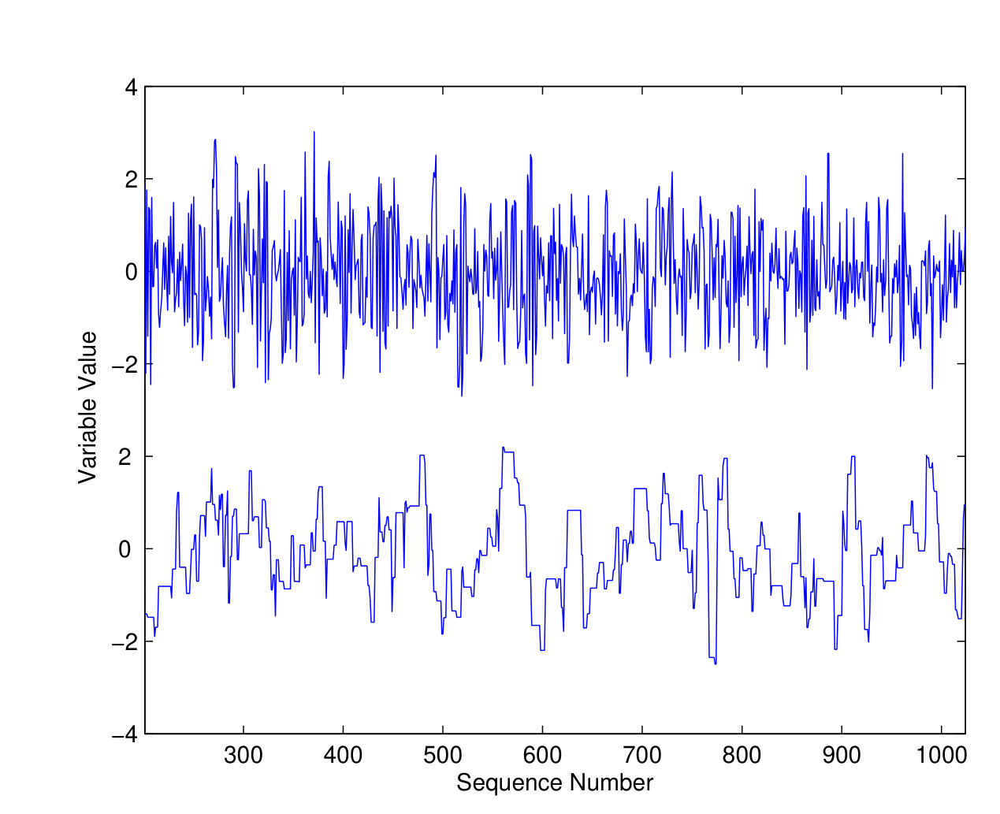
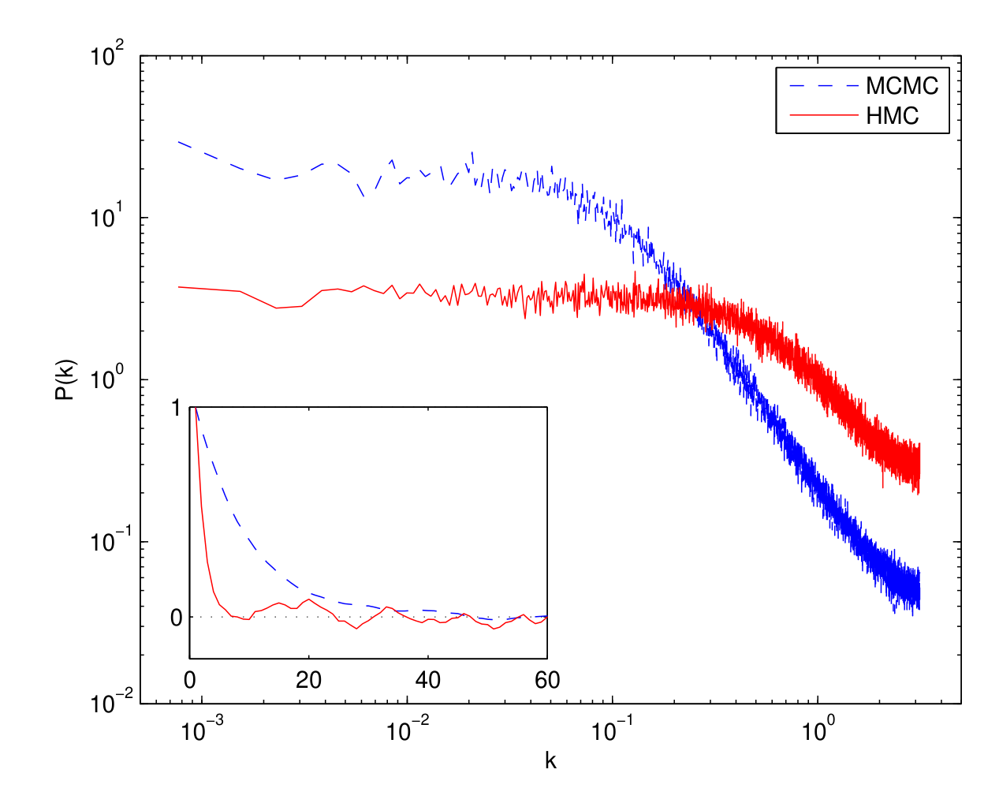
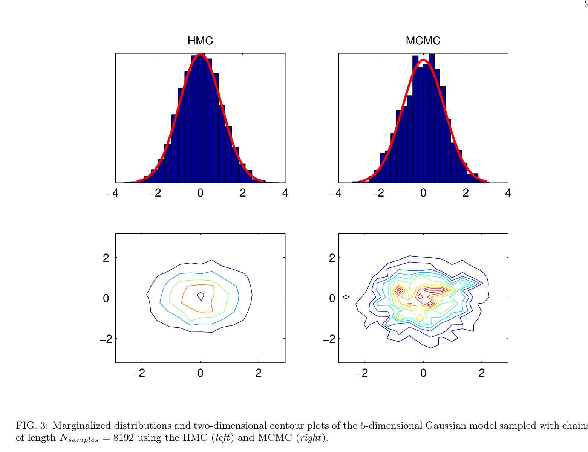
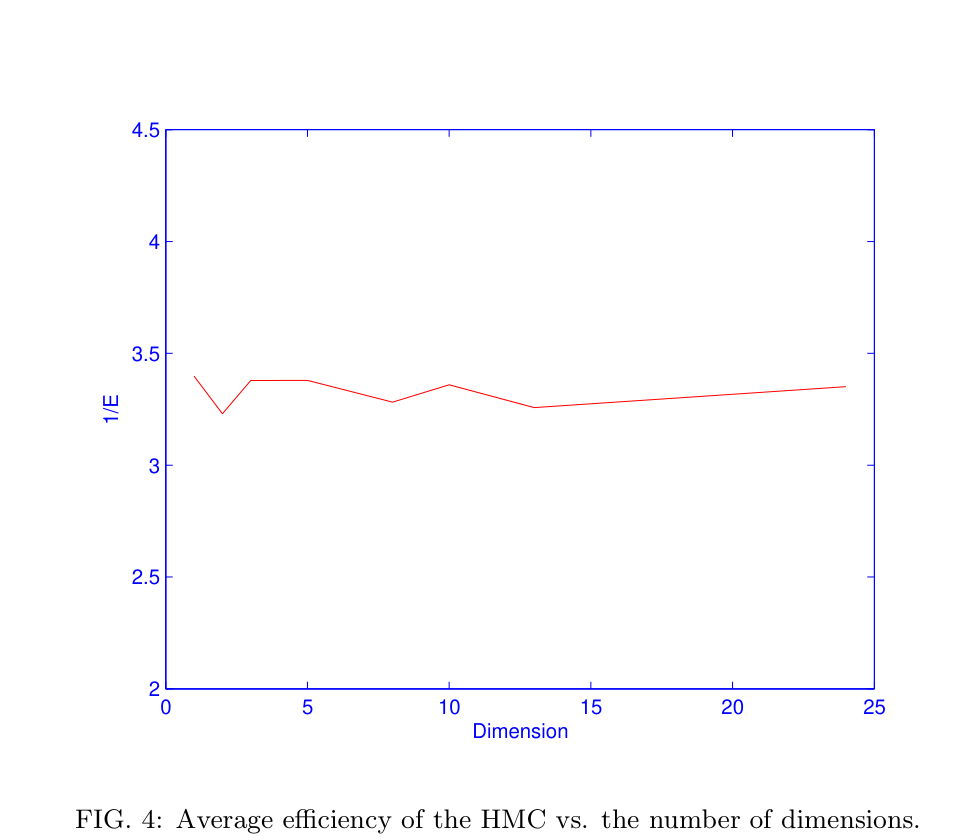
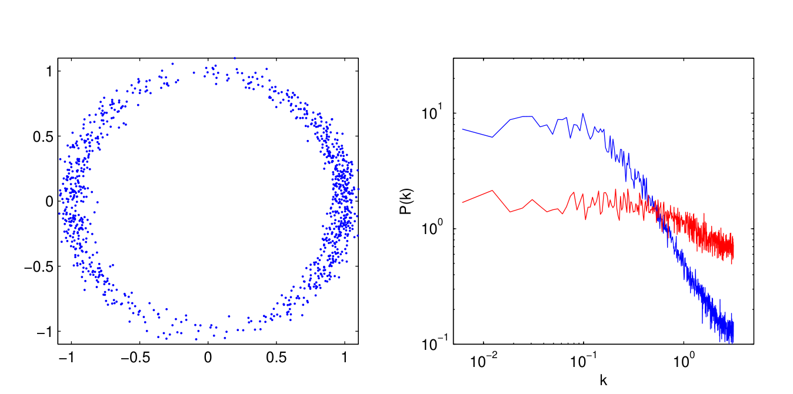
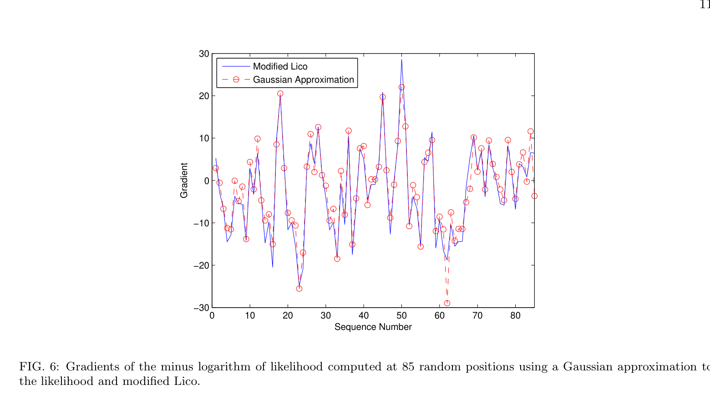
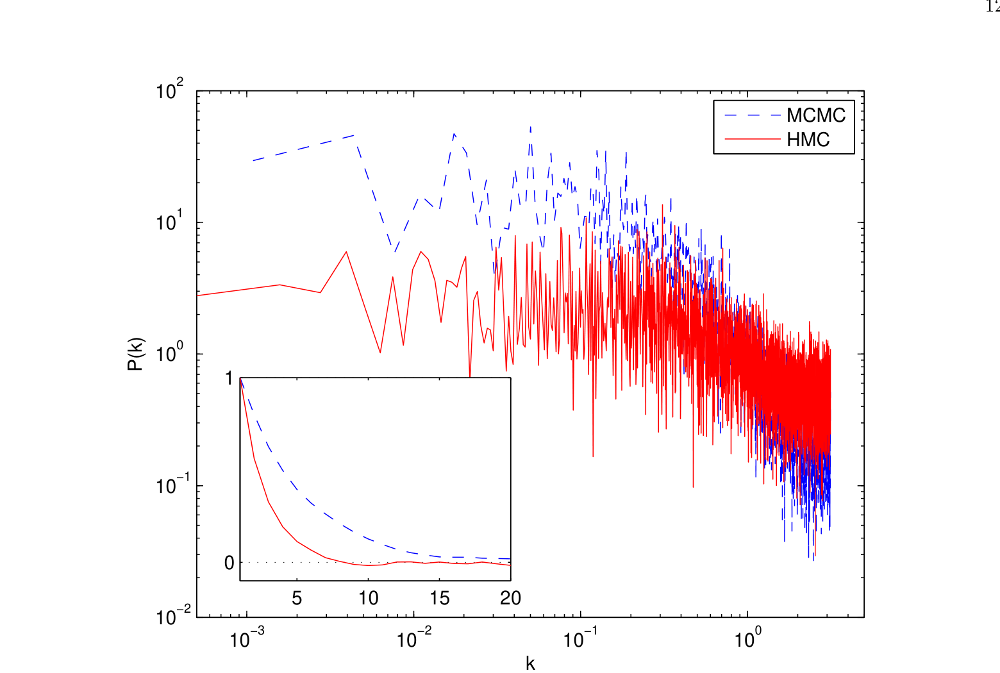
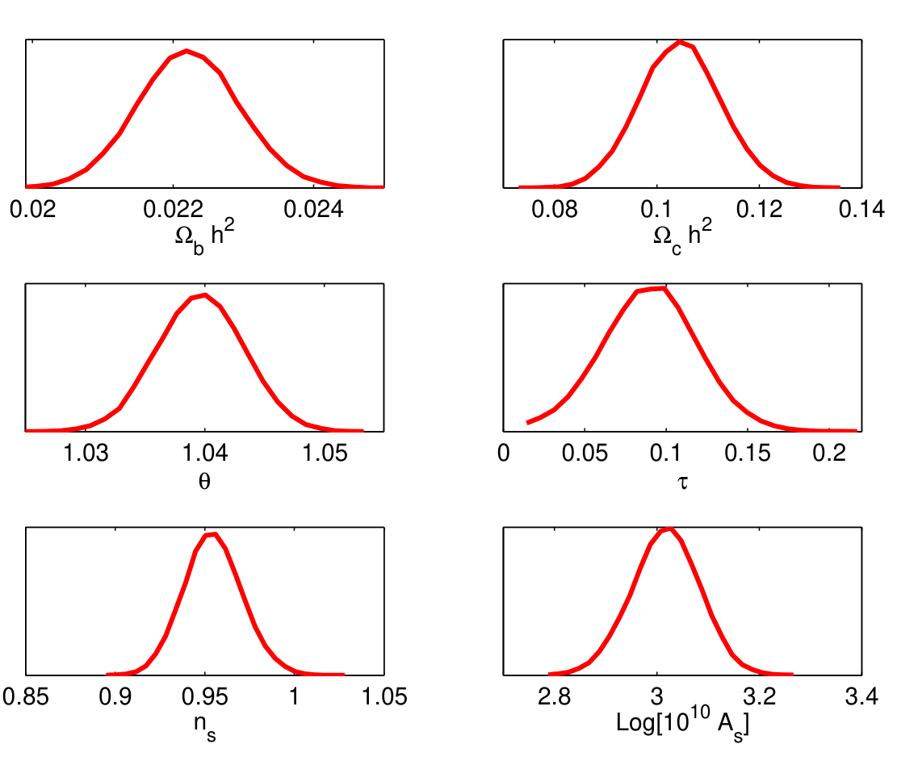

> What if the best way to explore the universe's parameters was to stop wandering randomly --- and start rolling downhill?*

**Based on the Paper:** Amir Hajian, "Efficient Cosmological Parameter Estimation with Hamiltonian Monte Carlo,"
[Phys. Rev. D **75**, 083525 (2007)](https://journals.aps.org/prd/abstract/10.1103/PhysRevD.75.083525) | [arXiv:astro-ph/0608679](https://arxiv.org/abs/astro-ph/0608679)
*Department of Physics & Department of Astrophysical Sciences, Princeton University.*

---

## A Motivating Problem: Measuring the Universe Is Computationally Expensive

Studying Cosmic Microwave Background (CMB) ushered cosmology into the era of precision science. For the first time, we had exquisitely detailed maps of the afterglow of the Big Bang, and the challenge shifted from *collecting* data to *interpreting* it. Cosmological models describe the universe with a handful of parameters: how much dark matter there is, how fast the universe is expanding, how lumpy the primordial density field was, and so on. Fitting these models to WMAP data means navigating a complex, high-dimensional probability landscape.

The workhorse tool for this job has been **Markov Chain Monte Carlo (MCMC)**, algorithms that wander through parameter space, drawing samples from the posterior distribution of cosmological parameters given the data. Standard MCMC packages like `CosmoMC` have become essential infrastructure in the field.

But there's a catch. Traditional MCMC methods are **random walkers**. They stumble around parameter space taking small, tentative steps. In high dimensions, this random walk becomes painfully slow: acceptance rates plummet, consecutive samples are highly correlated, and chains need to run for a very long time before they yield reliable estimates. With upcoming experiments like ACT and Planck probing ever smaller angular scales, the computational cost was set to explode.

This paper takes a different approach: **Hamiltonian Monte Carlo (HMC)** --- a method that replaces the aimless random walk with the elegant, directed motion of Hamiltonian dynamics. The payoff is striking: for a standard 6-parameter cosmological model, HMC is nearly **an order of magnitude** more efficient than the Metropolis algorithm.

---

## Background: Bayesian Inference and MCMC

Before diving into HMC, it helps to understand the machinery it improves upon.

### Bayes' Theorem in Cosmology

The fundamental equation driving this entire enterprise is Bayes' theorem:

$$
\pi(\{x_i\} | \text{data}) \propto f(\text{data} | \{x_i\}) \cdot p(\{x_i\})
$$

Here, $\pi$ is the **posterior** (what we want to know about the parameters after seeing the data), $f$ is the **likelihood** (the probability of the data given a model), and $p$ is the **prior** (our pre-existing beliefs). The goal is to compute expectations over this posterior, means, variances, confidence intervals, which requires evaluating integrals over all *D* dimensions of parameter space:

$$
\langle x_k | \text{data} \rangle = \int x_k \, \pi(\{x_i\} | \text{data}) \, dx_1 \, dx_2 \cdots dx_D
$$

At large *D*, these integrals become intractable analytically. Monte Carlo methods let us approximate them by drawing samples.

### The Monte Carlo Idea

If we can draw *N* independent samples $x_1, x_2, \ldots, x_N$ from the target distribution $p(x)$, then any integral can be approximated as a simple average:

$$
I = \int f(x) \, p(x) \, dx \approx \frac{1}{N} \sum_{i=1}^{N} f(x_i)
$$

The challenge is: how do you draw samples from a complicated, high-dimensional distribution that you can't write in closed form?

### The Metropolis Algorithm: A Random Walk

The classic answer is the **Metropolis-Hastings algorithm**. Starting from some point in parameter space, it proposes a random step and accepts or rejects it based on the ratio of probabilities:

```
Random Walk Metropolis
─────────────────────────────────────
1:  initialize x₀
2:  for i = 1 to N_steps
3:      sample Δx from proposal distribution: Δx ~ q(Δx|x)
4:      x* = x + Δx
5:      draw α ~ Uniform(0, 1)
6:      if α < min{1, p(x*)/p(x)}
7:          xᵢ = x*          ← accept the new point
8:      else
9:          xᵢ = x₍ᵢ₋₁₎     ← stay put
10: end for
```

This works, but it has serious problems in high dimensions:

- **Low acceptance rate:** Many proposed steps land in low-probability regions and get rejected.
- **High correlations:** Consecutive accepted samples are very close together, so you need a huge number of them to get independent information.
- **Slow mixing:** The chain takes a long time to explore the full distribution.

The optimal step-size for the Metropolis algorithm with a Gaussian proposal scales as $\sigma_T \approx 2.4\sigma_0 / \sqrt{D}$, which means steps shrink as dimensionality grows. The efficiency scales as $E \approx 1/(3.3D)$, inversely proportional to the number of dimensions.

---

## The Key Idea: Hamiltonian Monte Carlo

Here's where things get interesting. HMC borrows a beautiful idea from physics. Instead of taking random steps, it **simulates the motion of a fictitious physical system** rolling over the probability landscape.

### The Physics Analogy

For each parameter $x_i$ in our model, HMC introduces a conjugate **momentum variable** $u_i$. It then defines a Hamiltonian, the total energy, as:

$$
H(\mathbf{x}, \mathbf{u}) = U(\mathbf{x}) + K(\mathbf{u})
$$

where:
- $U(\mathbf{x}) = -\ln p(\mathbf{x})$ is the **potential energy** (the negative log of the target density)
- $K(\mathbf{u}) = \mathbf{u}^T \mathbf{u} / 2$ is the **kinetic energy**

The joint distribution over positions and momenta is:

$$
p(\mathbf{x}, \mathbf{u}) \propto \exp(-H(\mathbf{x}, \mathbf{u})) = p(\mathbf{x}) \cdot \mathcal{N}(\mathbf{u}; 0, 1)
$$

This is separable! The marginal distribution of **x** is exactly the target $p(\mathbf{x})$ we want to sample from. The momenta are just independent standard normals that we layer on top.

### How It Moves: Leapfrog Through Parameter Space

The system evolves according to Hamilton's equations of motion:

$$
\dot{x}_i = u_i, \qquad \dot{u}_i = -\frac{\partial H}{\partial x_i}
$$

These dynamics are **time-reversible** and **volume-preserving**, crucial properties that guarantee the algorithm samples correctly from the target distribution. In practice, the continuous dynamics are simulated using the **leapfrog integrator**, a symplectic integrator that approximately preserves the Hamiltonian:

$$
u_i(t + \tfrac{\epsilon}{2}) = u_i(t) - \tfrac{\epsilon}{2} \left(\frac{\partial U}{\partial x_i}\right)_{x(t)}
$$
$$
x_i(t + \epsilon) = x_i(t) + \epsilon \, u_i(t + \tfrac{\epsilon}{2})
$$
$$
u_i(t + \tfrac{\epsilon}{2}) = u_i(t) - \tfrac{\epsilon}{2} \left(\frac{\partial U}{\partial x_i}\right)_{x(t+\epsilon)}
$$

The leapfrog integrator doesn't preserve the Hamiltonian exactly, there's a small energy error from the finite step-size. But this is elegantly handled: a final Metropolis accept/reject step corrects for the discretization error, accepting the endpoint with probability $\min\{1, e^{-(H^* - H)}\}$. The dynamics do the heavy lifting of proposing good moves; the Metropolis step keeps the sampling exact.

### The Full Algorithm

```
Hamiltonian Monte Carlo
─────────────────────────────────────
1:  initialize x₍₀₎
2:  for i = 1 to N_samples
3:      u ~ N(0, 1)                              ← draw fresh momenta
4:      (x*₍₀₎, u*₍₀₎) = (x₍ᵢ₋₁₎, u)            ← set initial state
5:      for j = 1 to N                            ← leapfrog integration
6:          make a leapfrog move: (x*₍ⱼ₋₁₎, u*₍ⱼ₋₁₎) → (x*₍ⱼ₎, u*₍ⱼ₎)
7:      end for
8:      (x*, u*) = (x*₍ₙ₎, u*₍ₙ₎)                ← proposal point
9:      draw α ~ Uniform(0, 1)
10:     if α < min{1, exp(-(H(x*,u*) - H(x,u)))} ← Metropolis step
11:         x₍ᵢ₎ = x*        ← accept
12:     else
13:         x₍ᵢ₎ = x₍ᵢ₋₁₎   ← reject
14: end for
```

The key insight: instead of taking one blind random step, HMC takes *N* coordinated leapfrog steps that follow the contours of the probability landscape. The trajectory can make **large jumps** to distant but equally probable regions of parameter space, dramatically reducing correlations between successive samples.

### Tuning Parameters

HMC has two parameters to tune:

1. **Step-size $\epsilon$**: Must be small enough for accurate leapfrog integration. A reasonable choice satisfies $\epsilon < (\partial^2 H / \partial x^2)^{-1/2}$, i.e., smaller than the natural time-scale of the system.
2. **Number of leapfrog steps $N$**: Should be large enough to move the walker far from the starting point. A useful rule of thumb is $N\epsilon = \sigma_0$ (the standard deviation of the target).

Randomizing $N\epsilon$ helps avoid resonance effects where the trajectory might loop back to its starting point.

---

## Measuring Performance: How Do You Know Your Sampler Is Any Good?

Claiming one algorithm is "better" than another requires careful measurement. You can't just eyeball a chain and declare victory. The paper uses four complementary diagnostics to quantify convergence and efficiency:

**Autocorrelation function** $\rho(l)$: Measures how correlated sample $x_i$ is with sample $x_{i+l}$. An ideal sampler has $\rho(l) \to 0$ quickly.

**Autocorrelation length** $L$: A single number summarizing the correlations:
$$L = 1 + 2\sum_{l=1}^{l_{\max}} \rho(l)$$
$L = 1$ is perfect (independent samples). Larger $L$ means more wasted computation.

**Power spectrum** $P(k)$: The Fourier transform of the chain. An ideal sampler produces white noise (flat $P(k)$). Correlated chains have excess power at low $k$.

**Efficiency** $E$: The ratio of independent draws to total MCMC iterations:
$$E = \frac{\sigma_0^2}{P_0}$$
where $P_0 = P(k=0)$ is the zero-frequency power. $E = 1$ is ideal; $E^{-1}$ tells you how many times longer your chain needs to be compared to independent sampling.

---

## Results: HMC vs. Traditional MCMC

### Test 1: The 6-Dimensional Gaussian

The first test is clean and simple: sample from a 6-dimensional isotropic Gaussian ($\sigma_0 = 1$) using chains of length $N_{\text{samples}} = 8192$.



*Figure 1: Chain traces from HMC (top) and Metropolis (bottom) sampling a 6D Gaussian. The HMC chain shows rapid, full-amplitude oscillations, it's exploring the distribution efficiently. The Metropolis chain is sluggish by comparison, drifting slowly through parameter space.*

The numbers tell a striking story:
- **HMC acceptance rate: 99%** vs. **Metropolis: 25%**
- HMC accepts independent samples **4 times more often** than traditional MCMC

The power spectra reveal the difference even more clearly:



*Figure 2: Power spectra of the two chains. The HMC (red solid line) reaches the white-noise floor at $k \approx 0.1$, while the Metropolis chain (blue dashed line) doesn't flatten until $k \approx 0.02$. The inset shows autocorrelation functions, HMC's dies off dramatically faster.*

Reading the efficiency directly from the power spectra:

$$
\frac{E_{\text{HMC}}}{E_{\text{MCMC}}} = \frac{P_0^{\text{MCMC}}}{P_0^{\text{HMC}}} \approx 6
$$

**In 6 dimensions, an MCMC chain needs to be 6 times longer than an HMC chain for the same accuracy.**

The marginal distributions confirm this visually:



*Figure 3: Same chain length, very different results. HMC (left) recovers clean histograms and tight contour plots. The Metropolis sampler (right) produces noisy, ragged contours, it simply hasn't explored enough of the space.*

### The Scaling Advantage: HMC Gets Better in Higher Dimensions

This is the paper's most powerful result. Repeating the Gaussian test across dimensions 2 through 25:



*Figure 4: The inverse efficiency ($1/E$) of HMC stays roughly constant (~3.3) as dimensionality increases. This is remarkable.*

For HMC, the efficiency **remains constant** regardless of dimensionality. Compare this to the optimal Metropolis algorithm, where efficiency scales as $E \approx 1/(3.3D)$. The ratio of efficiencies is therefore:

$$
\frac{E_{\text{HMC}}}{E_{\text{MCMC}}} \approx D
$$

**In $D$ dimensions, HMC chains are $D$ times shorter than Metropolis chains for equivalent performance.** For a 6-parameter cosmological model, that's a factor of 6. For future models with 20+ parameters, the advantage becomes enormous.

### Test 2: Non-Gaussian, Curved Distributions

Gaussians are the easy case. Real posterior distributions in cosmology are rarely so well-behaved, parameter degeneracies create curved, banana-shaped ridges in the likelihood surface, and the Metropolis algorithm's isotropic random steps are poorly suited to follow them. A step-size tuned for the narrow direction of the ridge will barely move along it; a step-size tuned for the long direction will constantly overshoot and get rejected.

To stress-test HMC, the paper chooses a deliberately nasty target, a thin, curved crescent (the "worst case scenario" from Dunkley et al., 2005):

$$
E = \frac{(x^2 + y^2 - 1)^2}{8\sigma_1^2} + \frac{y^2}{2\sigma_2^2}
$$



*Figure 5: HMC handles this curved, non-Gaussian distribution with ease. The 1000 samples (left) faithfully trace the crescent shape. The power spectrum (right) tells the quantitative story: HMC (red) reaches white noise much sooner than MCMC (blue), meaning far less wasted computation.*

Because HMC's leapfrog trajectories follow the natural curvature of the probability landscape, rolling along the crescent rather than bouncing across it, it navigates these geometries far more efficiently than a random walker ever could. This is directly relevant to cosmology, where degeneracies between parameters (e.g., between $\Omega_m$ and $H_0$) create exactly these kinds of curved ridges in the posterior.

---

## Application to Real Cosmology: The 6-Parameter Flat $\Lambda$CDM Model

Toy models are encouraging, but the real question is: does HMC hold up when plugged into an actual cosmological analysis pipeline? The paper applies HMC to the standard 6-parameter flat $\Lambda$CDM model, the same model that `CosmoMC` fits to WMAP data every day. The six parameters are:

| Parameter | Description |
|-----------|-------------|
| $\Omega_b h^2$ | Baryon density |
| $\Omega_c h^2$ | Cold dark matter density |
| $\theta$ | Angular size of the sound horizon |
| $\tau$ | Optical depth to reionization |
| $n_s$ | Scalar spectral index |
| $A_s$ | Amplitude of primordial fluctuations |

### The Gradient Challenge

There's a practical wrinkle. HMC requires the **gradient** of the log-likelihood at each step, the force that steers the Hamiltonian trajectory. In cosmology, computing the exact likelihood involves running a Boltzmann code (like CAMB) to generate the CMB power spectrum, an expensive black-box operation for which analytical gradients aren't available.

The paper solves this with two increasingly sophisticated approximations:

#### Zeroth-Order Approximation: Gaussian Fit

Run a short exploratory MCMC chain first, then fit a Gaussian to the log-likelihood:

$$
\mathcal{L} \simeq (\mathbf{x} - \overline{\mathbf{x}})^\dagger C^{-1} (\mathbf{x} - \overline{\mathbf{x}}) \, \sigma_{\mathcal{L}} + \overline{\mathcal{L}}
$$

The gradient of this simple quadratic function serves as an approximate gradient for HMC. Even this crude approximation yields an **81% acceptance rate** and improves efficiency by a factor of 3.

#### Better Gradients: Using Lico

A more sophisticated approach uses `Lico` (the likelihood routine from the `Pico` package) to perform a piecewise fourth-order polynomial fit to the log-likelihood across 30 regions of parameter space. This gives much better gradient estimates:



*Figure 6: The two gradient estimation methods agree closely. The modified Lico captures more detail, but even the simple Gaussian approximation is surprisingly good.*

### Head-to-Head: HMC vs. CosmoMC

With gradient estimation in hand, HMC is run on the full 6-parameter LCDM model and compared against `CosmoMC`'s default Metropolis sampler. Both generate 16,000 samples.

- **HMC acceptance rate: 98%** (with randomized leapfrog steps $N\epsilon \sim \text{Uniform}(0, 3)\sigma_i$)
- **Metropolis acceptance rate: 35%**

The autocorrelation lengths tell the story:


| | $\Omega_b h^2$ | $\Omega_c h^2$ | $\theta$ | $\tau$ | $n_s$ | $A_s$ | **Average** |
|---|---|---|---|---|---|---|---|
| **MCMC** | 11.5 | 19.6 | 11.7 | 28.9 | 17.8 | 13.5 | **17.1** |
| **HMC** | 3.2 | 2.8 | 4.0 | 2.9 | 3.4 | 3.8 | **3.3** |

*Table I: Autocorrelation lengths of the sampled chains from the 6-parameter flat LCDM model.*

The average autocorrelation length drops from **17.1** (Metropolis) to **3.3** (HMC), a factor of ~5 improvement. The power spectra confirm this:



*Figure 7: Power spectra for HMC (red solid) and Metropolis (blue dashed) on the real LCDM model. The inset shows autocorrelation functions for $\Omega_b h^2$. HMC is almost a factor of 6 more efficient, and nearly an order of magnitude better overall.*

The resulting marginalized distributions from HMC are clean and well-converged:



*Figure 8: Posterior distributions for all six cosmological parameters recovered by HMC. These match the expected results while requiring much shorter chains.*

---

## Why This Matters: A Summary of HMC's Advantages

**It gets better as problems get harder.** While Metropolis efficiency degrades as $1/D$, HMC stays constant. In $D$ dimensions, you need $D$ times fewer samples. For the 6-parameter $\Lambda$CDM model, that's a factor of ~6. For future models with 20+ parameters, the advantage becomes transformative.

**It's exact.** Unlike interpolation-based speed-ups, HMC samples from the *true* posterior distribution. The only approximation is in the gradient estimation used to steer the leapfrog trajectories, and even a rough Gaussian estimate of the gradient is enough to improve efficiency by a factor of 3. Better gradients mean higher acceptance rates, but the sampling remains exact regardless.

**It handles ugly distributions gracefully.** The banana-shaped degeneracies common in cosmological posteriors (think $\Omega_m$, $H_0$ or $\tau$, $A_s$) are precisely the situations where Metropolis flounders. HMC's dynamics naturally follow the curvature.

**It's easy to deploy.** The paper demonstrates that HMC can be added as a module to existing parameter estimation codes like `CosmoMC`. No need to rewrite the pipeline, just swap the sampler.

**It stacks with other speed-ups.** Methods like `Pico` and `CMBWarp` reduce the *cost per likelihood evaluation*. HMC reduces the *number of evaluations you need*. Use both, and the total speed-up is multiplicative.

---

## The Bottom Line

The core message of this paper is simple and powerful: **don't walk when you can glide.** The Metropolis algorithm explores parameter space like a blindfolded hiker taking random steps on a mountain, most steps are wasted, and progress is painfully slow. Hamiltonian Monte Carlo gives the hiker a topographic map and a pair of skis. By converting the probability landscape into a physical system and letting Hamiltonian dynamics do the navigation, HMC makes large, informed jumps that land in high-probability regions almost every time.

For the standard 6-parameter cosmological model, HMC delivers nearly an **order of magnitude improvement** in efficiency over the Metropolis method. And unlike speed-ups that reduce the cost per step (faster power spectrum codes, interpolated likelihoods), HMC reduces the *number of steps you need in the first place*. The two approaches are complementary, combine them, and Bayesian parameter estimation becomes remarkably fast.

Perhaps most importantly, the efficiency advantage scales with dimensionality. As the field moves toward models with more free parameters, extended dark energy equations of state, modified gravity, neutrino masses, tensor modes, the case for HMC only gets stronger. In a $D$-dimensional parameter space, you need $D$ times fewer HMC samples than Metropolis samples. That's not an incremental improvement, it's a qualitative change in what's computationally feasible.

---

*Paper: Amir Hajian, "Efficient Cosmological Parameter Estimation with Hamiltonian Monte Carlo," [Phys. Rev. D **75**, 083525 (2007)](https://journals.aps.org/prd/abstract/10.1103/PhysRevD.75.083525) | [arXiv:astro-ph/0608679](https://arxiv.org/abs/astro-ph/0608679).*
